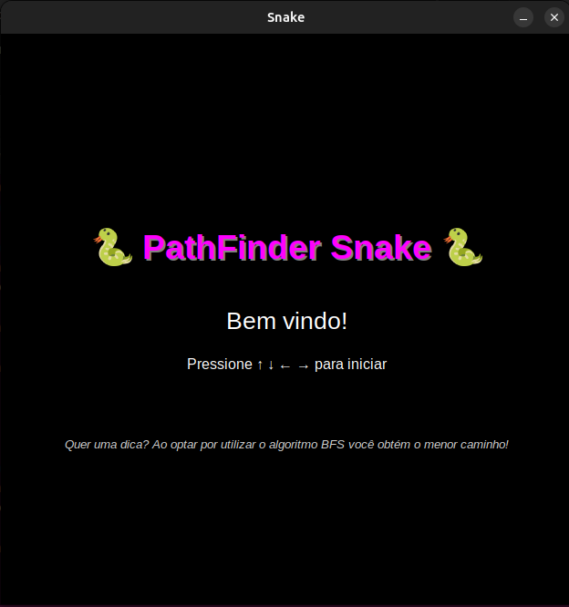
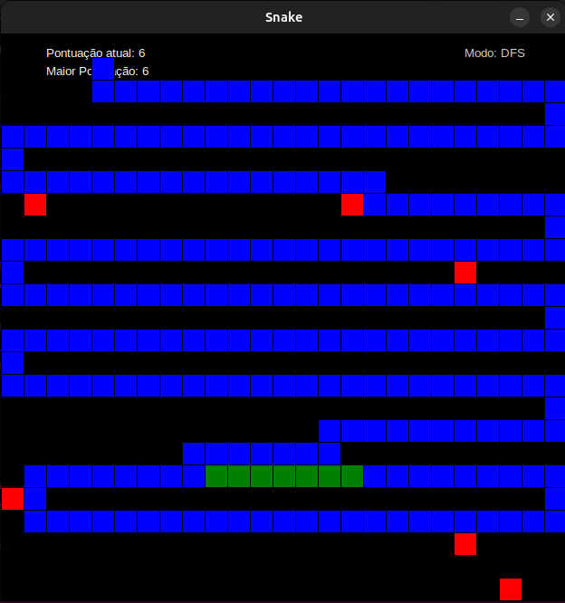
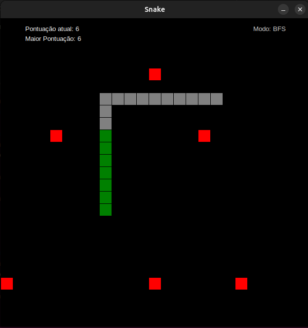

# **PathFinder Snake**

### **Número do trabalho:** 1
### **Conteúdo da Disciplina:** Grafos, BFS, DFS

### **Alunos**

| Matrícula   | Aluno                                       |
|-------------|---------------------------------------------|
| 190033011   |  Luana Souza Silva Torres          |
| 211045196  | Suzane Alves Duarte        |


## **Sobre**

Este projeto consiste em uma aplicação interativa desenvolvida em Python que simula um jogo da cobrinha com um diferencial pedagógico: a aplicação de algoritmos de busca em grafos — Busca em Largura (BFS) e Busca em Profundidade (DFS) — para encontrar o caminho ideal até a próxima comida.

A cobrinha se move por um grid representado internamente como um grafo, onde cada célula é um vértice e as conexões entre as células adjacentes (cima, baixo, esquerda, direita) são as arestas. O jogador pode escolher, no início da partida, se deseja que o jogo utilize o algoritmo BFS ou DFS para sugerir o caminho até a comida, pressionando a tecla espaço para visualizá-lo. As possíveis rotas são destacadas dinamicamente na tela com cores diferentes: cinza para BFS e azul para DFS.

Além disso, a cada comida coletada, um novo obstáculo (em vermelho) é gerado aleatoriamente no mapa, aumentando a dificuldade do jogo progressivamente. Se a cobrinha colidir com uma parede, o próprio corpo ou um obstáculo, o jogo termina. O sistema também registra e exibe a maior pontuação atingida durante a sessão.

O jogo combina interatividade, desafio e aprendizado, sendo uma ferramenta visual e lúdica para a compreensão de conceitos fundamentais da Teoria dos Grafos.

## Objetivos do Projeto
- Aplicar conceitos de teoria dos grafos em um cenário visual e interativo.
- Implementar e comparar algoritmos clássicos de busca: DFS e BFS.
- Proporcionar uma forma intuitiva de compreender como grafos e algoritmos são aplicados em problemas do mundo real.
- Estimular a análise de caminhos em ambientes com obstáculos.


## **Screenshots**

A seguir, são apresentados screenshots do projeto em funcionamento. 

Primeiramente, a tela inicial do jogo: 

 

Uma das possibilidades de rotas sugeridas ao optar-se por DFS: 

  

E o mapa do jogo contendo obstáculos e a pontuação: 

 


## **Instalação**

- **Linguagem:** Python  
- **Bibliotecas:** `tkinter` (interface gráfica), `random`, `collections`

### **Pré-requisitos:**  

Você precisa apenas do Python instalado (de preferência a partir da versão 3.6), pois o tkinter já vem embutido na maioria das instalações. 

Se você estiver utilizando Ubuntu/Debian/Linux para verificar se o tkinter está instalado abra um terminal e rode:

```bash
python3 -m tkinter
```

Se abrir uma janelinha com "This is a Tcl/Tk..." então está tudo certo! Se der erro, use:

```bash
sudo apt install python3-tk
``` 

No caso do Windows ele já vem instalado com o Python, então: 

**Como executar o jogo:**
```bash
python3 snake.py
```


## **Uso**

1. Execute o jogo com o comando acima.

2. Aguarde a tela inicial e pressione uma das setas (↑ ↓ ← →) para começar.

3. Escolha o algoritmo de busca pressionando:

    - B para BFS

    - D para DFS

4. A cada comida consumida:

    - A cobra cresce.

    - Um novo obstáculo é adicionado.

5. Para visualizar o caminho sugerido pelo algoritmo:

    - Pressione a tecla espaço durante o jogo.

6. A pontuação atual e o recorde são mostrados no canto superior esquerdo.

7. O jogo termina se a cobra colidir com o corpo, a parede ou um obstáculo.

## **Outros**

- Cores:

    - Verde: Cobrinha

    - Branco: Comida

    - Vermelho: Obstáculos

    - Cinza (BFS) / Azul (DFS): Caminho sugerido

- A lógica do grafo está embutida nas representações do grid e nas funções de busca.

- O jogo reinicia automaticamente ao pressionar qualquer tecla após o Game Over.
